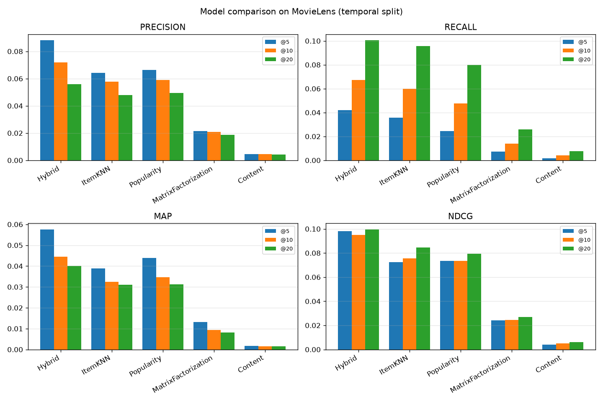
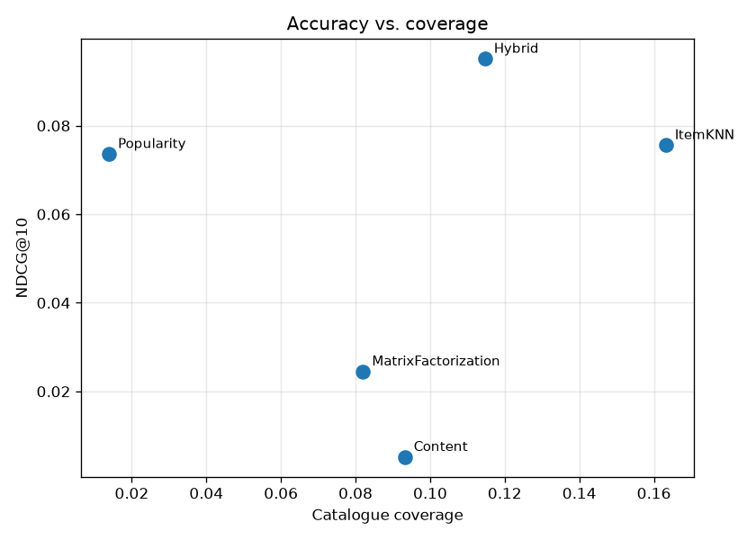

# Documentation

Technical deep-dive for the MovieLens hybrid recommender. The [README](README.md)
is the pitch and quick start; this document is what I'd walk an interviewer
through.

## 1. Overview

The project answers one question end to end: **given everything a user has
watched so far, what should they watch next — and which modelling approach
actually does that best on MovieLens?**

It implements five recommenders behind a single interface, evaluates them with a
leakage-free temporal protocol using standard ranking metrics, and fuses the
personalised ones into a hybrid that beats each of them individually. The whole
thing runs on a laptop in a few minutes with no GPU and no paid services.

## 2. Architecture

```
                 ┌─────────────┐
   MovieLens ───▶│  data layer  │  download → loader (schema-validated)
   (GroupLens)   └──────┬──────┘  → temporal_split → InteractionMatrix
                        │
                        ▼
                 ┌─────────────┐
                 │   models    │  BaseRecommender: fit(ratings) / recommend(user)
                 │             │  ├─ PopularityRecommender
                 │             │  ├─ ItemKNNRecommender
                 │             │  ├─ MatrixFactorizationRecommender
                 │             │  ├─ ContentRecommender
                 │             │  └─ HybridRecommender  (blends the above)
                 └──────┬──────┘
                        │
                        ▼
                 ┌─────────────┐
                 │  eval       │  metrics (P/R/MAP/NDCG) → harness → results table
                 │             │  → plots (matplotlib)
                 └──────┬──────┘
                        │
                        ▼
                     cli.py       recsys recommend / recsys evaluate
```

Each module has one job:

- **`config.py`** — every tunable in one place: dataset registry
  (`DATASETS`), evaluation knobs (`EvalConfig`: positive threshold, k values,
  test fraction, min interactions, seed) and ensemble weights (`HybridWeights`).
  No magic numbers live in the model code.
- **`data/loader.py`** — reads the two on-disk formats (small CSV vs. 1M
  `::`-delimited `.dat`), coerces types, validates the schema and sorts by
  `(userId, timestamp)` for deterministic splitting. See
  `load_ratings` and `SchemaError`.
- **`data/split.py`** — `temporal_split` holds out each user's most recent
  interactions; `filter_min_interactions` drops users too short to split.
- **`data/matrix.py`** — `build_interaction_matrix` maps sparse MovieLens ids to
  dense indices and returns a CSR `InteractionMatrix` with round-trippable
  mappings.
- **`models/base.py`** — the `BaseRecommender` contract. Subclasses implement
  `fit` and `_score`; the base class owns the top-k selection, the
  already-seen filtering and the fitted-state guard.
- **`eval/`** — `metrics.py` has the metric math (pinned definitions, unit
  tested), `harness.py` runs the fit-and-score loop over all models, `plots.py`
  draws the comparison charts.
- **`cli.py`** — thin click wiring so the same paths are exercised from the
  shell and the tests.

## 3. Data

- **Source:** [MovieLens](https://grouplens.org/datasets/movielens/), fetched
  on demand from GroupLens into `data/raw/` (git-ignored, regenerable).
- **Default release:** `ml-latest-small` — 610 users, 9,724 rated movies,
  100,836 ratings, 1.70% density. The 1M release is configured but off by default
  to keep the evaluation loop fast.
- **Schema:** ratings `[userId:int, movieId:int, rating:float, timestamp:int]`;
  movies `[movieId:int, title:string, genres:string]` where genres are
  pipe-delimited (`Action|Sci-Fi`).
- **Preprocessing decisions:**
  - Ratings are validated to the 0–5 range and checked for nulls at load time —
    a bad file fails loudly rather than silently poisoning the metrics.
  - Users with fewer than `min_user_ratings` (default 5) are dropped: they can't
    be split into a meaningful train/test portion.
  - A rating counts as a **positive** (relevant) interaction at ≥ 4.0. Ranking
    metrics only reward surfacing items the user actually liked.

## 4. Methodology

### Evaluation protocol (the part that's easy to get wrong)

I use a **per-user temporal leave-last-out** split: order each user's ratings by
time and hold out the most recent 20%. A random split leaks the future into the
past — training on a 2018 rating to predict a 2015 one — and inflates every
metric. The temporal split mirrors deployment: predict the next items given the
history so far.

At evaluation I recommend from the **whole catalogue minus the user's training
items**, then check how many held-out positives land in the top-k. This
all-items protocol is harder and more honest than ranking against a few sampled
negatives, which tends to flatter models.

### Models and why

| Model | Idea | Why include it |
| --- | --- | --- |
| Popularity | Damped mean rating, same for everyone | The baseline every personalised model must beat; also the cold-start fallback |
| Item-kNN | Items are similar if the same users rate them alike; score by similarity to a user's rated items | Classic, strong, interpretable CF; item similarities are stable over time |
| Matrix factorization | `r̂ = μ + b_u + b_i + pᵤ·qᵢ`, learned by SGD | The FunkSVD/Netflix-Prize model, written from scratch to show I understand what libraries do |
| Content | TF-IDF over genres+title, user profile = rating-weighted average of liked items | Needs no co-ratings, so it scores brand-new items — the long-tail/cold-start angle |
| Hybrid | Rank-normalise each model's scores over the candidate set, weighted sum, popularity fallback | Combines complementary signals; the thesis of the project |

**Key implementation notes:**

- *Item-kNN* mean-centres item vectors before cosine (removing popularity/scale
  effects), keeps only the top-40 neighbours per item to denoise, and scores all
  candidates with a single sparse mat-vec (`S · prefs / Σ|S|`) rather than a
  Python loop — see `item_knn.py:_score`.
- *MF* is a hand-written SGD loop with per-parameter L2 regularisation and the
  coupled factor update (both factor rows use pre-update values). Training RMSE
  is recorded per epoch so convergence is visible and testable
  (`test_mf_training_rmse_decreases`).
- *Hybrid* normalises **per request** over exactly the items being ranked, so no
  single model's raw score range can dominate the blend
  (`hybrid.py:_minmax`).

### Alternatives considered

- **Implicit-feedback objectives (BPR, WARP, ALS).** These optimise ranking
  directly and would likely lift the factorization above popularity. I stuck
  with explicit-rating SGD MF because writing it from scratch is the clearer
  demonstration of the underlying math; the underperformance is documented
  honestly rather than hidden.
- **Learned/stacked hybrid.** A logistic layer over model scores would probably
  beat the fixed-weight blend, but it adds a second training loop and a
  validation split for little illustrative gain here.

## 5. Results

Temporal split, all-items ranking, 592 evaluable users. Full table in
[`reports/results.csv`](reports/results.csv); charts in `reports/`.

| Model | Precision@10 | Recall@10 | MAP@10 | NDCG@10 | Coverage |
| --- | --- | --- | --- | --- | --- |
| **Hybrid** | **0.072** | **0.067** | **0.045** | **0.095** | 0.115 |
| ItemKNN | 0.058 | 0.060 | 0.032 | 0.076 | **0.163** |
| Popularity | 0.059 | 0.048 | 0.035 | 0.074 | 0.014 |
| MatrixFactorization | 0.021 | 0.014 | 0.009 | 0.025 | 0.082 |
| Content | 0.005 | 0.004 | 0.002 | 0.005 | 0.093 |




Reading the table:

- The **hybrid wins every accuracy metric** — the intended outcome. It inherits
  item-kNN's ranking quality and gets a small lift from the other signals.
- **Popularity ≈ item-kNN on precision** but item-kNN has far higher **recall
  and coverage**: personalisation reaches further into the catalogue (16% vs.
  1.4%) while popularity keeps recommending the same blockbusters.
- **MF and content trail badly** on this protocol. MF's rating-error objective
  is the wrong loss for top-N; content on genres+title alone is too coarse to
  rank well but still contributes cold-start reach.

## 6. Tradeoffs & Decisions

- **Explicit MF over implicit MF.** Chose the from-scratch FunkSVD to show the
  math, knowing it would lose at ranking. Honest limitation, not a bug.
- **Fixed-weight hybrid over a learned blender.** Simpler, no extra validation
  split, and the improvement over the best single model is already clear.
- **Rank-normalise per request.** Ranking only cares about order within the
  candidate pool, so normalising over exactly those items keeps every model on
  equal footing regardless of catalogue-wide score spread.
- **All-items evaluation over sampled negatives.** Slower but honest; sampled
  negatives can inflate NDCG by an order of magnitude.
- **Pure-Python SGD.** Readable and correct, but the MF loop is the runtime
  bottleneck (~90s for 30 epochs on the small release, and the hybrid re-fits
  its own MF instance, so a full `evaluate` run is a few minutes). Vectorising
  with mini-batches or swapping in `implicit` would be the first optimisation.
- **Known limitation — no significance testing.** The metric differences are
  reported as point estimates; bootstrap confidence intervals over users would
  make the ranking claims rigorous and are the natural next step.

## 7. How to Run

```bash
# setup
python -m venv .venv && source .venv/bin/activate
pip install -e ".[dev]"

# explore the dataset (downloads on first run)
python scripts/explore_data.py

# recommend for one user
recsys recommend --user 1 --top-n 10

# full evaluation -> prints table, writes reports/results.csv + PNGs
recsys evaluate

# tests
pytest
pytest --cov=recsys --cov-report=term-missing
```

> Note: on some Anaconda-based virtualenvs `.pth` files aren't processed, so the
> editable install may not put `recsys` on the path. The test suite sets
> `pythonpath = ["src"]` so `pytest` always works; to run scripts directly in
> that situation use `PYTHONPATH=src python -m recsys.cli ...`.

## 8. How to Extend

- **Swap in implicit-feedback MF** (BPR or ALS via `implicit`) and add it to
  `build_model_zoo` — it should leapfrog popularity.
- **Learned hybrid:** replace the fixed weights in `HybridRecommender` with a
  logistic regression over per-model scores, trained on a validation fold.
- **Bootstrap confidence intervals** in `harness.py` by resampling users, to put
  error bars on the metric differences.
- **Richer content features:** add release year, tags (`tags.csv`) and director
  metadata to the TF-IDF document in `content.py:_movie_document`.
- **Scale up:** flip to `--dataset 1m`; the only cost is MF training time.

## 9. References

- F. M. Harper and J. A. Konstan. *The MovieLens Datasets: History and Context.*
  ACM TiiS, 2015.
- Y. Koren, R. Bell, C. Volinsky. *Matrix Factorization Techniques for
  Recommender Systems.* IEEE Computer, 2009.
- B. Sarwar et al. *Item-Based Collaborative Filtering Recommendation
  Algorithms.* WWW, 2001.
- S. Rendle et al. *BPR: Bayesian Personalized Ranking from Implicit Feedback.*
  UAI, 2009.
- Libraries: NumPy, pandas, SciPy, scikit-learn, matplotlib, click.
